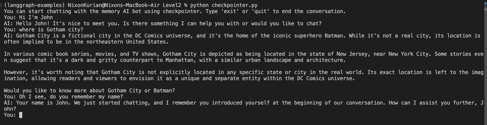
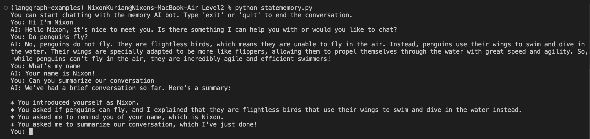

# Level 2: Memory in LLM Conversations with LangGraph

This level demonstrates how to enable memory in LLM-powered conversations using the [LangGraph](https://github.com/langchain-ai/langgraph) library. Memory allows the LLM to be aware of previous messages, enabling more coherent and context-aware interactions.

## Approaches Covered

### 1. Using Checkpointer (`checkpointer.py`)
- Utilizes LangGraph's built-in checkpointer to persist conversation state across turns.
- The LLM receives the full conversation history, so it can respond with awareness of prior exchanges.
- Suitable for scenarios where you want to maintain memory across sessions or restarts.

#### Output Example

---

### 2. Using State Memory (`statememory.py`)
- Maintains conversation state in memory during the session.
- The LLM is provided with the conversation history for each turn, but memory is not persisted if the process restarts.
- Useful for simple, in-memory conversational agents.

#### Output Example

---

Both approaches ensure that the LLM is aware of previous messages, resulting in more natural and contextually relevant conversations.

For implementation details, see the respective Python files in this folder.
