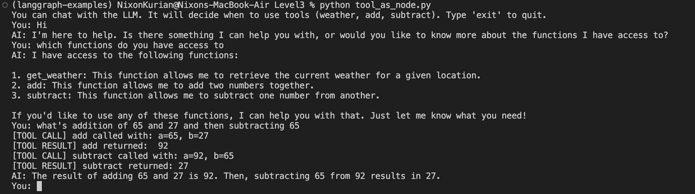

# Level 3: Calling Tools with LangGraph

This example demonstrates how to build a conversational agent using [LangGraph](https://github.com/langchain-ai/langgraph) that can call Python tools/functions as needed. The agent uses an LLM (Groq's Llama-3) and can decide when to invoke tools such as weather lookup, city suggestions, and basic arithmetic.


## Features
- **Conversational agent**: Interact with the LLM in a chat loop.
- **Tool calling**: The LLM can call Python functions ("tools") to answer user queries.
- **Verbose tool calls**: The code prints out which tool is called, with what arguments, and the result.
- **Easy extensibility**: Add your own tools by defining a function and decorating it with `@tool` (and optionally a verbose wrapper).

## How it Works
- The agent is built using a `StateGraph` from LangGraph.
- The LLM is set up with tool bindings, so it can decide when to call a tool.
- When a tool is called, the system prints the tool name, arguments, and result for transparency.
- The conversation continues until the user types `exit` or `quit`.

## Running the Example
1. **Install dependencies** (in your virtual environment):
   ```bash
   pip install langgraph langchain-core langchain-groq python-dotenv
   ```
2. **Set your Groq API key** in a `.env` file:
   ```env
   GROQ_API_KEY=your_groq_api_key_here
   ```
3. **Run the script:**
   ```bash
   python tool_as_node.py
   ```
4. **Interact with the agent:**
   - Try questions like:
     - `What's the weather in SF?`
     - `What are the coolest cities?`
     - `What's addition of 59 and 69?`

## Adding Your Own Tools
1. **Define your function** and decorate it with `@tool` (or a verbose wrapper):
   ```python
   from langchain_core.tools import tool

   @tool
   def multiply(a: int, b: int) -> int:
       """Multiply two numbers."""
       return a * b
   ```
2. **Add your tool to the tools list:**
   ```python
   tools = [get_weather, get_coolest_cities, add, subtract, multiply]
   ```
3. **(Optional) Use a verbose wrapper** to print calls/results for debugging:
   ```python
   def verbose_tool(tool_func):
        @wraps(tool_func)
        def wrapper(*args, **kwargs):
            arg_str = []
            if args:
                arg_str.extend([str(a) for a in args])
            if kwargs:
                arg_str.extend([f"{k}={v}" for k, v in kwargs.items()])
            print(f"[TOOL CALL] {tool_func.__name__} called with: {', '.join(arg_str)}")
            result = tool_func(*args, **kwargs)
            print(f"[TOOL RESULT] {tool_func.__name__} returned: {result}")
            return result
        return tool(wrapper)

    # Instead of decorating with tool you can use the custom decorator verbose_tool
   @verbose_tool
   def my_tool(...):
       ...
   ```

## Output Example


## References
- [LangGraph Documentation](https://langchain-ai.github.io/langgraph/)
- [LangChain Tools](https://python.langchain.com/docs/modules/agents/tools/)

---

Feel free to modify and extend this example to suit your own use cases!
